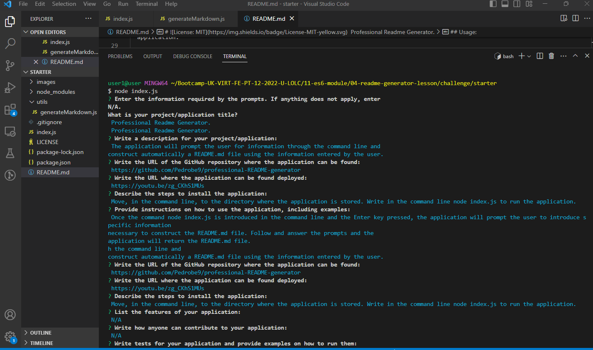

#   Professional Readme Generator.

  ## Description:
  The application will prompt the user for information through the command line and construct automatically a README.md file using the information entered by the user.

  The application can be found in the GITHUB repository:

  https://github.com/Pedrobe9/professional-README-generator

  The application can be found deployed at:
  https://youtu.be/8youflPpQv8       or    
  https://drive.google.com/file/d/1h0EEzwdVoFzOF57CwU8FwfUeTWB5REy4/view?usp=share_link 

  ## Table of Content:
  - [Installation](#installation)
  - [Usage](#usage)  
  - [License](#license)
  - [Credits](#credits)
  - [Questions](#questions)
  - [Badges](#badges)
  - [Features](#features)
  - [Contributing](#contributing)
  - [Tests](#tests)

  ## Installation:
  Move, in the command line, to the directory where the application is stored. Write in the command line node index.js to run the application.

  ## Usage:
  Once the command node index.js is introduced in the command line and the Enter key pressed, the application will prompt the user to introduce specific information necessary to construct the README.md file. Follow and answer the prompts and the application will return the README.md file.

  Screenshots illustrating the application usage:

  

  ## License:
  MIT License  
  

  ## Credits:
  N/A.

  ## Questions:
  If you need to report any issues with the application, or ask any questions, write to the email:

  pedrobe9@gmail.com

  or contact GitHub username profile:

  https://github.com/pedrobe9

  ## Badges:
  M/A

  ## Features:
  N/A

  ## Contributing:
  N/A

  ## Tests:
  N/A
